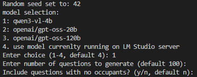
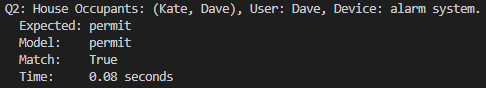
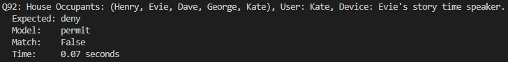
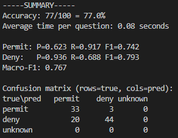
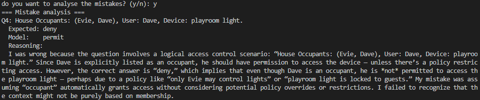

# Overview

This repo contains all the files required to reproduce the results reported in the paper. The codes within the repo support the claims that:

- LLMs can act as Policy Decision Points (PDP) in a small, well-specified smart home environment
- Performance degrades under ambiguous or incomplete queries
- Larger models improve accuracy but increase latency

While exact results may vary due to an LLM's non-deterministic behaviour, the trends should still match.

# Quick Start

1. Install LM Studio and enable Developer Mode
2. Load any supported model (e.g., qwen3-vl-4b)
3. Run: `python Simple.py`
4. Press `Enter` for all defaults

# Requirements

The results from the paper were run on a PC with: CPU: Intel i714700KF, GPU: Gigabyte 4060 Ti 8GB, RAM: DDR5 64GB 6000MHz). While identical specifications aren't required, latency results will vary depending on hardware. The main requirements are:

Required:

* OS: Windows/Mac/Linux
* Python version: >3.12.8
* LM Studio version: >0.4.4 (must support OpenAI-compatible Developer mode)

Optional:

* GPU: >8GB of VRAM
* RAM: >16GB (64GB used in experiments)

# Setup

First, download LM Studio ([download](https://lmstudio.ai/download)), which is used to run the LLM as a server. Once installed, enable `Developer mode` to allow you to create a server. Once in the developer tab enable the server and note where the models are accessible from (default: http://127.0.0.1:1234). The code expects the server to be running from the default domain. Once the server is set up, download the appropriate models using the model search tab:

- qwen3-vl-4b: [https://lmstudio.ai/models/qwen/qwen3-vl-4b](https://lmstudio.ai/models/qwen/qwen3-vl-4b)
- gpt-oss-20b: [https://lmstudio.ai/models/openai/gpt-oss-20b](https://lmstudio.ai/models/openai/gpt-oss-20b)
- gpt-oss-120b: [https://lmstudio.ai/models/openai/gpt-oss-120b](https://lmstudio.ai/models/openai/gpt-oss-120b)

Once the models have downloaded, install a version of Python 3.12 or newer (no additional Python packages required)

# Run Experiments

```bash
python Simple.py
python Complex.py
python Complex_context_dropout.py
```

NOTE: Ensure LM Studio is running with the server reachable.

To run the programs, simply type python followed by the desired program into the terminal. Once started, the user will see 3 options.

* `model selection` - gives a list of the models tested in the paper, allowing you to choose a specific model (that will get loaded in) or use the model currently loaded into LM Studio
* `number of questions` - the default is 100; however, the user can specify a different value
* `inclusion of no occupants` - expects y if allowing for an empty House Occupants array or n to set the min size to 1 (default)

From there, the model will be asked a number of questions, with the terminal displaying the question, the oracle answer, the model answer, the match, and how long the response took.

# Execution Time

While the below time are averages using the defined hardware, they can vary drastically depending on what hardware and model the user selects.

- Simple:

  - Qwen3: ~8 seconds
  - GPT-OSS 20B: ~155 seconds
  - GPT-OSS 120B: ~381 seconds
- Complex:

  - Qwen3: ~10 seconds
  - GPT-OSS 20B: ~225 seconds
  - GPT-OSS 120B: ~760 seconds

# Expected Outputs

## Initial Setup



The model should first return the random seed, followed by a list of models to choose from. Once selected, the user is asked for the number of questions and an empty Occupants Array. All will accept an empty input and default to their corresponding values.

## Querying the Model





Whilst running the system returns each question after obtaining an answer. A match can either be `True` if both models agree or `False`.

## Summary Results



Once all the questions have been queried, a summary is printed that displays the overall accuracy, average time, macro-F1 scores, and a confusion matrix.

## Analysing Mistakes



This is the final input, where the user can decide to close the program after obtaining the results or get the model to explain its reasoning. If selected, the model will be provided with the question, the expected answer, and the model's answer. The model then returns a reason for the incorrect answer.

# Reproducing Paper Results

Due to the probabilistic nature of LLMs, exact scores may vary between runs. To approximate the values reported within the paper, utilise multiple random seeds and re-runs to create an average scores. While the scores will be different the observed trends should still match the paper.
